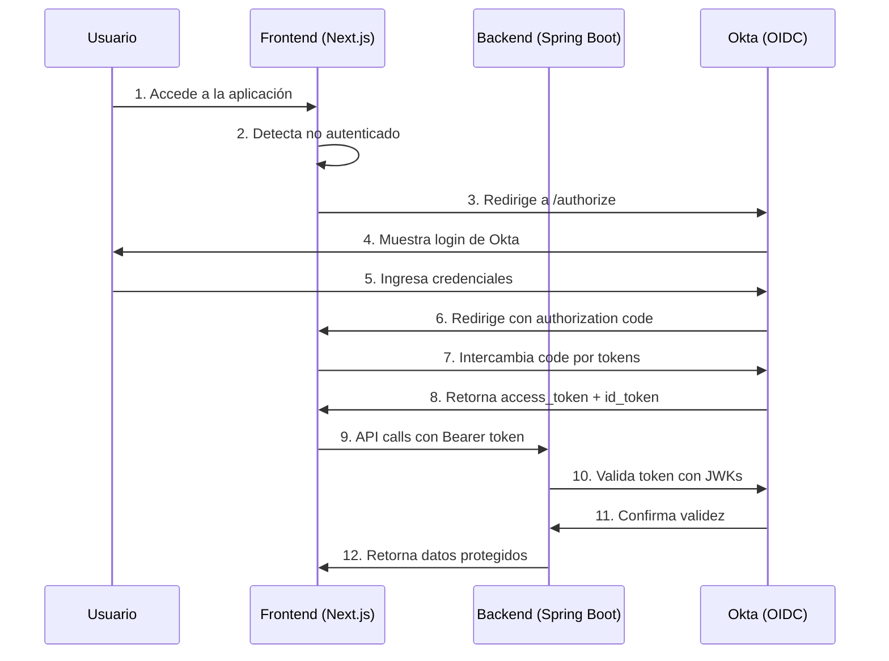
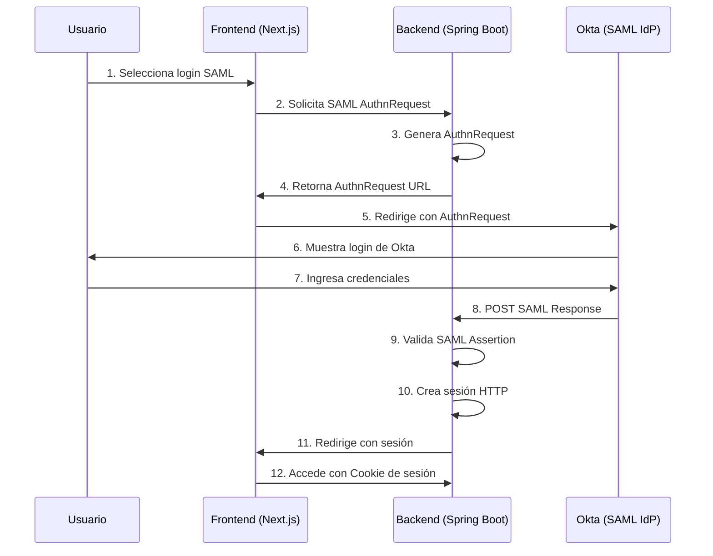

# Arquitectura de Autenticación - OIDC/OAuth 2.0 y SAML 2.0
## Flujos de Autenticación

### Flujo OIDC/OAuth 2.0

### Flujo SAML 2.0

## Visión General de la Arquitectura

Este proyecto implementa una arquitectura dual de autenticación que soporta tanto **OIDC/OAuth 2.0** como **SAML 2.0**, permitiendo a los usuarios elegir su método de autenticación preferido o requerido por su organización.

## Componentes Técnicos

### Frontend (Next.js)
- **Framework**: Next.js 14 con App Router
- **Autenticación**: @okta/okta-auth-js
- **Estado**: React hooks personalizados
- **UI**: Tailwind CSS + shadcn/ui

### Backend (Spring Boot)
- **Framework**: Spring Boot 3
- **Seguridad**: Spring Security 6
- **SAML**: Spring Security SAML2
- **Gestión de Sesiones**:
    - HTTP Sessions (SAML)
    - Stateless JWT (OIDC)

### Proveedor de Identidad
- **Okta**: Configurado para ambos protocolos
    - **OIDC**: Authorization Server
    - **SAML**: Identity Provider (IdP)